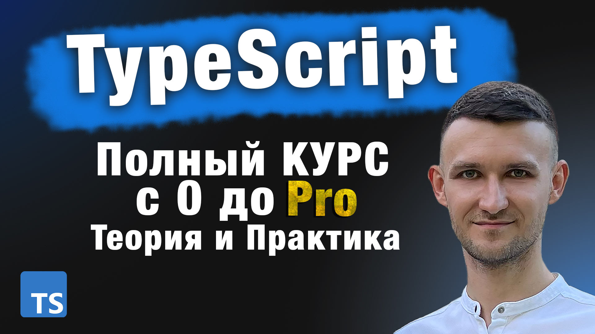

# Typescript full course from scratch
## TypeScript самый полноценный КУРС с 0 до Pro. Теория и практика

[Watch | Смотреть на Youtube](https://youtu.be/rPaRVcH9big)

[My Telegram | Мой телеграм канал](https://t.me/Dmitry_Kolotilshikov)

### Полноценный Курс по Typescript с самых основ до продвинутых тем. В курсе установим typescript локально, поднимем проект, настроим tsconfig, узнаем про модульность. 
### В данном курсе по Тайпскрипт мы изучим примитивные типы, массивы и кортежи, перечисления (enums), про any и unknown типы и как их лучше использовать, утверждения типов, типы объединения (union types). Изучим типы в рамках функций и классов, узнаем про интерфейсы в сравнении с типами, а также модификаторы доступа, абстрактные классы, пространства имен, декораторы, декларации. Плюс ко всему посмотрим на Typescript в React и Angular. 
# typescript-course
